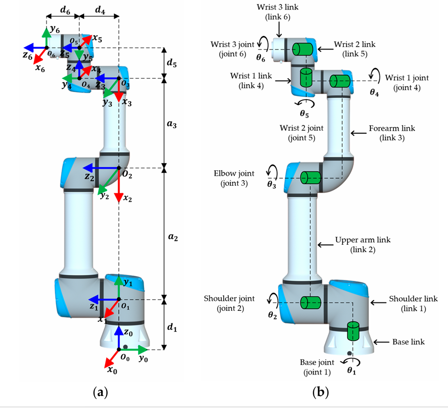

# 🤖 UR5e Pick & Place — Mô phỏng & Điều khiển Robot Công nghiệp

> Đồ án mô phỏng robot UR5e 6 bậc tự do với 3 chế độ vận hành:  
> **Manual** (tay) · **Auto** (máy trạng thái FSM) · **AI** (học tăng cường SAC)

---

## 🚀 Cài đặt & Chạy

```bash
# 1. Clone repo
git clone https://github.com/Elsa9999/doan_robot_ur5e.git
cd doan_robot_ur5e

# 2. Cài thư viện
pip install -r requirements.txt

# 3. Chạy giao diện
python -m hmi.app
```

---

## 🔬 Cơ sở Lý thuyết — Động học Robot UR5e

### 1. Quy tắc đặt trục Denavit-Hartenberg (DH)

Robot UR5e có **6 khớp xoay (Revolute)** và **7 link** (bao gồm đế). Mỗi khớp được gán một hệ trục tọa độ riêng theo quy tắc DH chuẩn (Standard Convention):



- **(a)** Hệ trục tọa độ (X₀Y₀Z₀ đến X₆Y₆Z₆) được gán theo quy tắc DH. Các thông số `a`, `d` được đo trực tiếp từ khoảng cách giữa các trục.
- **(b)** Tên gọi: Base Joint (θ₁) → Shoulder Joint (θ₂) → Elbow Joint (θ₃) → Wrist 1-2-3 (θ₄, θ₅, θ₆).

### 2. Bảng thông số DH của UR5e

Bảng DH được **đọc tự động từ file URDF** của hãng Universal Robots (không nhập tay):

| Khớp (i) | a (m) | d (m) | α (rad) | Mô tả |
|:---------:|------:|------:|--------:|-------|
| 1 | 0.0000 | 0.1625 | π/2 | Đế → Vai (Base → Shoulder) |
| 2 | -0.4250 | 0.0000 | 0 | Vai → Khuỷu (Shoulder → Elbow) |
| 3 | -0.3922 | 0.0000 | 0 | Khuỷu → Cổ tay 1 (Elbow → Wrist1) |
| 4 | 0.0000 | 0.1333 | π/2 | Cổ tay 1 → Cổ tay 2 |
| 5 | 0.0000 | 0.0997 | -π/2 | Cổ tay 2 → Cổ tay 3 |
| 6 | 0.0000 | 0.0996 | 0 | Cổ tay 3 → Đầu kẹp (End-Effector) |

Trong đó:
- **a** = chiều dài link (đo dọc trục X) — ví dụ `a₂ = -0.425m` là chiều dài bắp tay
- **d** = offset dọc trục Z — ví dụ `d₁ = 0.1625m` là chiều cao đế lên vai
- **α** = góc xoắn giữa 2 trục Z liên tiếp
- **θ** = góc quay thực tế của mô-tơ (biến số điều khiển)

### 3. Động học Thuận (Forward Kinematics)

**Bài toán:** Cho 6 góc quay θ₁...θ₆ → Tính tọa độ (X, Y, Z) của mũi kẹp.

**Công thức:** Nhân chuỗi 6 ma trận biến đổi DH 4×4:

```
T₀₆ = T₀₁ × T₁₂ × T₂₃ × T₃₄ × T₄₅ × T₅₆
```

Mỗi ma trận `Tᵢ` được tính từ 4 thông số DH:

```
     ┌                                             ┐
     │ cos(θ)  -sin(θ)·cos(α)  sin(θ)·sin(α)  a·cos(θ) │
Tᵢ = │ sin(θ)   cos(θ)·cos(α) -cos(θ)·sin(α)  a·sin(θ) │
     │ 0        sin(α)          cos(α)          d        │
     │ 0        0               0               1        │
     └                                             ┘
```

Kết quả `T₀₆`:
- **Cột cuối** (T[0,3], T[1,3], T[2,3]) = Tọa độ XYZ của mũi kẹp
- **Góc 3×3 trên trái** = Ma trận xoay → Chuyển sang Euler (Roll, Pitch, Yaw)

### 4. Động học Nghịch (Inverse Kinematics)

**Bài toán:** Ngược lại FK. Cho tọa độ (X, Y, Z) + hướng → Tính 6 góc quay.

**Phương pháp:** Giải tích hình học (Analytical Closed-form) — 6 bước:

| Bước | Tên gọi | Kỹ thuật | Kết quả |
|:----:|---------|----------|---------|
| 1 | Tìm Tâm cổ tay | Kinematic Decoupling: lùi d₆ dọc trục Z | Tọa độ Wrist Center |
| 2 | Giải θ₁ (Vai) | atan2 trên mặt phẳng XY | 2 nghiệm (Trái/Phải) |
| 3 | Giải θ₅ (Cổ tay) | Phương trình cos(θ₅) từ ma trận T₀₆ | 2 nghiệm (Sấp/Ngửa) |
| 4 | Giải θ₃ (Khuỷu) | Định lý Hàm số Cosin (tam giác a₂-a₃) | 2 nghiệm (Up/Down) |
| 5 | Giải θ₂ | atan2 kép | 1 nghiệm |
| 6 | Giải θ₄, θ₆ | Tổng góc + nghịch đảo ma trận | 1 nghiệm |

**Tổng:** 2 × 2 × 2 = **tối đa 8 cấu hình nghiệm** (Left/Right × Elbow Up/Down × Wrist Flip/NoFlip).

Nếu giải tích thất bại (vùng kỳ dị) → Tự động chuyển sang **L-BFGS-B** (quasi-Newton) làm dự phòng.

### 5. Kiểm chứng (Verification)

| Phương pháp | File | Tiêu chuẩn |
|-------------|------|------------|
| **So sánh với Matlab** | `forward_kinematics.py` | 3 test cases, sai số < 5mm = PASS |
| **Round-Trip (FK→IK→FK)** | `inverse_kinematics.py` | 4 test cases, sai số < 1mm = PASS |

```bash
python kinematics/forward_kinematics.py    # FK Verification
python kinematics/inverse_kinematics.py    # IK Verification
```

### 6. Quy hoạch Quỹ đạo (Trajectory Planning)

Biên dạng vận tốc hình thang (Trapezoid Velocity Profile):

```
Vận tốc
  │     ___________
  │    /           \          ← v_max (tốc độ tối đa)
  │   /             \
  │  /               \
  └──────────────────── thời gian
  Tăng tốc   Đều ga   Giảm tốc
```

- **Joint Trajectory:** Nội suy 6 góc khớp trực tiếp (nhanh, nhưng đường đi không thẳng).
- **Cartesian Trajectory:** Nội suy XYZ đường thẳng, gọi IK tại mỗi điểm (chậm hơn, nhưng robot đi thẳng).

---

## 📁 Chức năng từng file

### 📂 `kinematics/` — Lõi toán học (Động học Robot)

| File | Chức năng |
|------|-----------|
| `forward_kinematics.py` | **Động học Thuận (FK):** Nhập 6 góc khớp → Tính ra tọa độ XYZ + góc xoay của mũi kẹp. Dùng phép nhân chuỗi 6 ma trận DH 4×4. Bảng DH được đọc tự động từ file URDF. |
| `inverse_kinematics.py` | **Động học Nghịch (IK):** Nhập tọa độ XYZ mong muốn → Tính ra 6 góc khớp cần xoay. Hệ thống Hybrid: Lớp 1 giải tích (8 nghiệm, <1ms) + Lớp 2 số học L-BFGS-B (dự phòng). |
| `trajectory.py` | **Quy hoạch quỹ đạo:** Tạo đường đi mượt mà từ điểm A → B bằng biên dạng vận tốc hình thang (Tăng tốc → Đều ga → Giảm tốc). Hỗ trợ nội suy Joint Space và Cartesian Space. |
| `workspace_validator.py` | **Cảnh sát vùng cấm:** Kiểm tra tọa độ EE có nằm trong vùng an toàn không. Ngăn robot đập tay xuống bàn, vươn quá xa, hoặc đâm vào thùng rác. |

---

### 📂 `simulation/` — Thế giới vật lý 3D (PyBullet)

| File | Chức năng |
|------|-----------|
| `environment.py` | **Môi trường chính:** Dựng bàn, robot, thùng rác, cục mút trong PyBullet. Chứa hàm điều khiển mô-tơ (`set_joint_positions`), hàm di chuyển Cartesian (`move_ee_cartesian`), hàm gắp/nhả (`activate_gripper`). |
| `gripper.py` | **Giác hút chân không:** Mô phỏng giác hút bằng PyBullet Constraint (JOINT_FIXED). Khi hút = dán cứng vật vào đầu kẹp. Khi nhả = xóa ràng buộc, vật rơi tự do. |
| `pick_place_sm.py` | **Máy trạng thái FSM (chế độ Auto):** 11 trạng thái: IDLE → DETECT → APPROACH → DESCEND → PICK → LIFT → MOVE_TO_BIN → PLACE → RELEASE → RETREAT → DONE. Tự động gắp vật và thả vào thùng. |
| `object_detector.py` | **Camera ảo:** Dùng Raycast (bắn tia laser ảo) từ đầu robot xuống mặt bàn để dò vị trí vật thể. Tính sẵn các tư thế tiếp cận (Approach), gắp (Pick), nhấc (Lift). |
| `trajectory_executor.py` | **Bộ phát quỹ đạo:** Nhận vào JointTrajectory, mỗi bước vật lý (1/240s) đọc ra 1 điểm trên quỹ đạo và bơm xuống PyBullet. Giống kim đĩa than lướt trên rãnh nhạc. |
| `manual_controller.py` | **Điều khiển bằng bàn phím:** Dùng khi chạy PyBullet trực tiếp (không qua HMI). Hỗ trợ Joint Mode (Q/W/A/S...) và Cartesian Mode (phím mũi tên). |

---

### 📂 `hmi/` — Giao diện người dùng (PyQt5)

| File | Chức năng |
|------|-----------|
| `app.py` | **Điểm khởi chạy:** Import PyTorch trước PyQt5 (fix WinError 1114), tạo Splash Screen, khởi động SimBridge trong thread nền, mở MainWindow. |
| `main_window.py` | **Cửa sổ chính:** Ghép 4 tab điều khiển (Manual, Trajectory, Auto, AI) + Status Panel + Log Panel. Timer cập nhật giao diện mỗi 50ms (20 FPS). |
| `sim_bridge.py` | **Cầu nối HMI ↔ PyBullet:** Chạy trên Thread riêng ở 240Hz. Nhận lệnh từ GUI qua command_queue, thực thi trên PyBullet, trả kết quả qua state_queue. Quản lý 3 chế độ: Manual, Auto (FSM), AI (SAC). |

#### 📂 `hmi/widgets/` — Các bảng điều khiển con

| File | Chức năng |
|------|-----------|
| `joint_panel.py` | 6 thanh trượt (slider) điều khiển từng góc khớp riêng biệt. |
| `cartesian_panel.py` | Nhập tọa độ X, Y, Z + góc Roll, Pitch, Yaw → Bấm "Go To Pose" để di chuyển. Có nút Jog ±1cm theo từng trục. |
| `trajectory_panel.py` | Tạo danh sách waypoints, chọn kiểu nội suy (Joint/Cartesian), điều chỉnh tốc độ, bấm "Execute" để chạy quỹ đạo. |
| `auto_panel.py` | Bấm Start/Stop chế độ Auto FSM. Hiển thị trạng thái 11 bước + số chu kỳ đã hoàn thành. |
| `ai_panel.py` | Bấm Start/Stop chế độ AI (SAC). Hiển thị số lần gắp thành công. |
| `status_panel.py` | Hiển thị real-time: tọa độ XYZ, 6 góc khớp, trạng thái gripper, chế độ hoạt động. |
| `log_panel.py` | Console log hiển thị mọi sự kiện: IK thành công, lỗi, lệnh gửi, AI reward... |

---

### 📂 `utils/` — Tiện ích

| File | Chức năng |
|------|-----------|
| `transforms.py` | Chuyển đổi hệ tọa độ giữa DH (toán học) và PyBullet (mô phỏng). Robot bị xoay 180° + đặt trên bàn cao 0.42m nên cần biến đổi qua lại. |

---

### 📂 `urdf/` — Bản vẽ 3D Robot

| File | Chức năng |
|------|-----------|
| `ur5e_final.urdf` | File XML mô tả cấu trúc robot UR5e: 6 khớp, 7 link, kích thước, khối lượng. Được đọc bởi PyBullet để render 3D và bởi FK để trích xuất bảng DH. |
| `meshes/ur5e/` | Thư mục chứa file 3D (.stl, .dae) cho từng link của robot (vai, bắp tay, cẳng tay, cổ tay). |

---

### 📂 Gốc — Huấn luyện AI & Kiểm thử

| File | Chức năng |
|------|-----------|
| `train_17d_grasp.py` | Huấn luyện AI giai đoạn 1: Học gắp vật (SAC, 3M bước, ~1 tiếng). |
| `train_17d_place.py` | Huấn luyện AI giai đoạn 2: Học gắp + thả vào thùng (Transfer Learning, 5.5M bước, ~2.5 tiếng). |
| `requirements.txt` | Danh sách thư viện cần cài: pybullet, numpy, scipy, PyQt5, torch, stable-baselines3, gymnasium. |

---

## 📚 Tài liệu tham khảo

1. **Hawkins, K. P. (2013).** *Analytic Inverse Kinematics for the Universal Robots UR-5/UR-10 Arms.* Georgia Institute of Technology.
2. **Andersen, R. S. (2018).** *Kinematics of a UR5.* Aalborg University.
3. **Haarnoja, T., et al. (2018).** *Soft Actor-Critic: Off-Policy Maximum Entropy Deep RL with a Stochastic Actor.* ICML 2018.
4. **Universal Robots (2024).** *UR5e Technical Specifications & URDF.*
